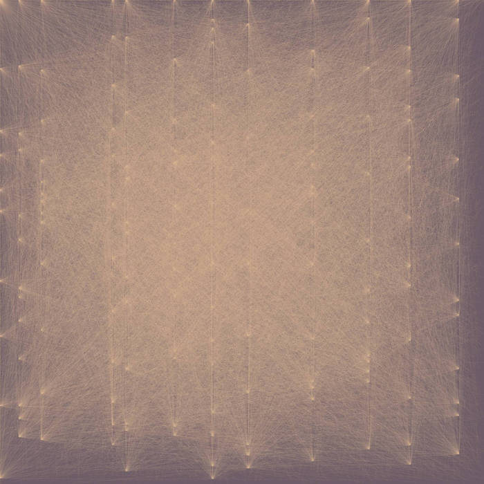

# Boundaries

Generative music making patch. Developed as part of an MA in Art &amp; Technology in University of Limerick in 2021. Research was conducted on generative and algorithmic approaches to music composition. These patches and the music that was composed using them are the product of that research.

## General
There are 2 patches in this repository, one was used in the creation of Boundaries I and II and the other in the creation of Boundaries III, IV and V. The final results can be heard here:

- [Listen](https://eoin-osullivan.bandcamp.com/album/boundaries)

To create this work, I recorded sections of music in Logic Pro X, exported these as audio files and imported them into the Max patches. These patches can be downloaded and used to create your own pieces of generative music. Simply download the patches, open them in Max, load in your own samples and start the patch. Further instructions and information are contained within the patches/sub-patches.

## Credits
This project utilises the [ml.* library](https://www.benjamindaysmith.com/ml-machine-learning-toolkit-in-max) to implement algorithmic processes such as markov chains.
